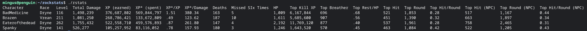

# rockstats

Computes some statistics on your player log files that are not available in game. In order to use this, you need to keep the entire log file for your character's entire history, or start a new character where you do keep the log file.

To use:
* Checkout the source code using git
* Fire up the bash shell on Linux or Mac, or Windows Subsystem for Linux (Windows)
* Add some player log files with the log name ending in .log to the rstats directory
* Run the tool: `bash rstats`

Legend for statistics that are computed:
* `Race`
* `Level`
* `Total Damage`: Total damage this character has ever dealt. Only works with `combat brief`
* `XP (earned)`: The raw amount of experience given by actual NPC kills
* `XP* (spent)`: The total amount of experience you've spent on stats, including any racial bonuses you've accrued. For example, a Dryne that raises SUPP will have much more XP spent than earned.
* `XP*/XP`: A measure (ratio) of how much bonus experience you've gained from not using raise auto.
* `XP*/Damage`: A measure of how much raising damage-related stats has earned you bonus experience.
* `Deaths`
* `Missed Six Times`: How many times did you whiff it? Could be a measure of your agility.
* `HP`
* `Top Kill XP`: How much experience did you get from your top NPC kill?
* `Top Breather`: The most HP you've rested for
* `Top Rest / HP`: The proportion of your hit points that you've rested in one breather. A measure of your KMED.
* `Top Hit`: Your biggest hit
* `Top Round`: Your biggest round
* `Top Hit/Round`: A measure of strength, agility and level
* `Top Hit (NPC)`: The hardest an NPC has hit you in a single hit
* `Top Round (NPC)`: An NPC's hardest round against you. Limited by your HP.
* `Top Hit / Round (NPC)`: NPC's hardest hit to round ratio against you.
